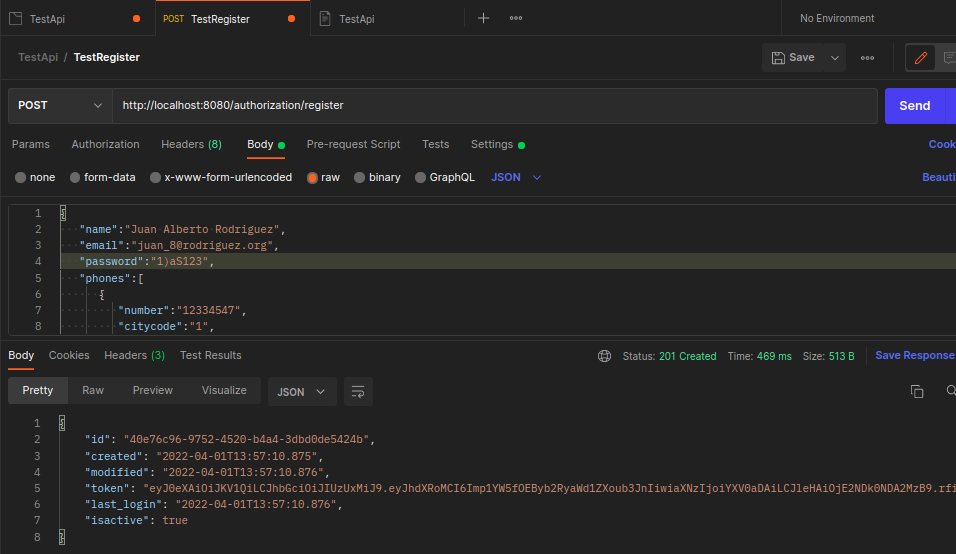
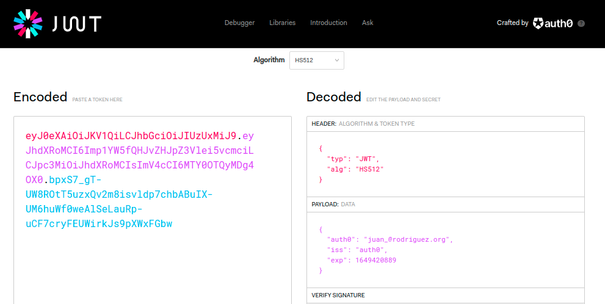

Proyecto api rest evaluacion

## Diagrama 

## Como Probar
- Importar proyecto a Intellij Idea
- Run EvaluationApplication.java
- Import TestApi.postman_collection.json en Postman (cambiar puerto de localhost si fuese mecesario)

- Copiar token y pegarlo en la pagina https://jwt.io/ para validar contenido
